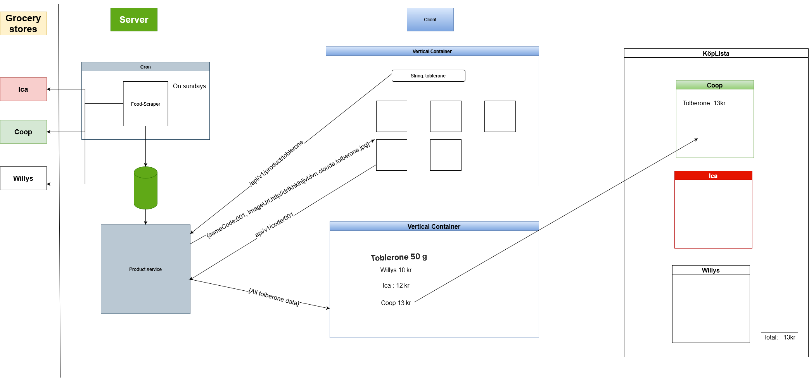

I developed this app under the first year as a webbprogrammerare student at Linnéuniversitet i Kalmar 

# Spar Handla 

Spar Handla is a smart shopping companion that makes price comparison and shopping list organization. Developed with the goal to save time and money while shopping in various grocery stores, Spar Handla was planned to be an ultimate tool for managing shopping needs efficiently.

## Table of Contents
- [Features](#features)
- [How to Use](#how-to-use)
- [Technology Stack](#technology-stack)
- [Installation](#installation)
- [Contributing](#contributing)
- [PostMortem](#postmortem)
- [Vision](#vision)
- [Developers](#developers)
- [Demo](#demo)

## Features

- **Price Comparison Service**: Compare prices from major grocery stores like Stora Coop, ICA Maxi, and Willys in Kalmar.
- **Shopping Lists**: Create and manage multiple shopping lists for different stores.
- **Digital Receipts**: Planned feature for saving users' digital receipts.
- **Persistent Data**: Shopping lists are saved in the client, ensuring access even after the application restarts.

## How to Use

The application offers an intuitive web interface that allows users to:

1. Search for products and compare prices across different grocery stores.
2. Add or remove items from their shopping lists.
3. View and manage shopping lists for each store.

## Technology Stack

- **Frontend**: React, CSS, Bootstrap
- **Backend**: Node.js, Express
- **Database**: MongoDB (planned)
- **Other Tools**: Nginx, ESLint, Prettier

## Installation

To get started with Spar Handla, clone the repository and install its dependencies:

```bash
git clone https://github.com/spar-handla/spar-handla-client.git
cd spar-handla-client
npm install
npm start
```

The application should now be running on `localhost:3000`.

...

## Project Architecture

The image above outlines the architecture of the Spar Handla project, including the interaction between the client, server, and the grocery stores' data. It demonstrates the flow from data scraping to user interface presentation.

...


## PostMortem

Highlights from the postmortem of the project can be found in the [PostMortem.md](PostMortem.md) document.

## Vision

Read about the vision and purpose of Spar Handla in the [ProjectVision.md](ProjectVision.md) document.

## Developers

- **Shirin Meirkhan**
  - *Role*: Lead Developer
  - *Contact*: shirinmeirkhan@gmail.com

## Demo

Watch a live demo of the Spar Handla app on [YouTube](https://www.youtube.com/watch?v=jF2Kbc2kAAw).
